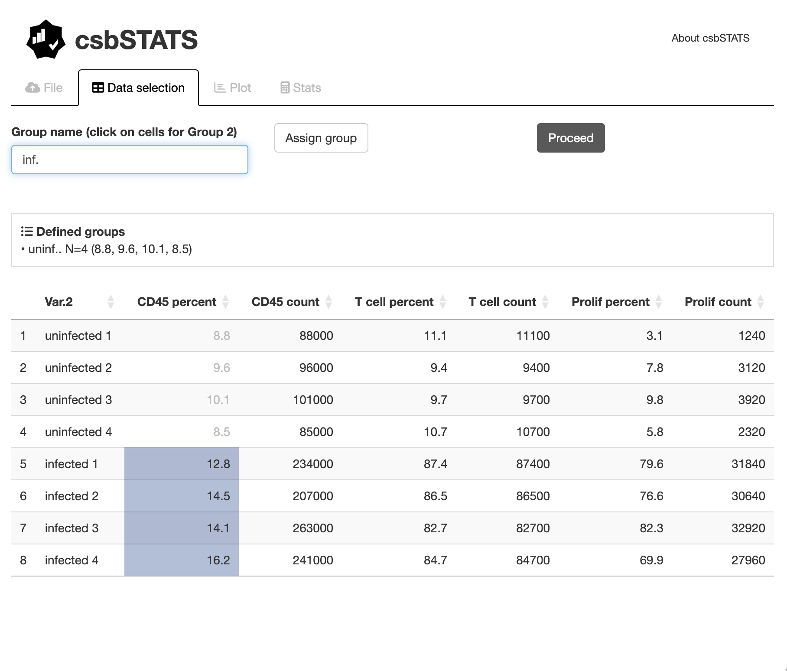
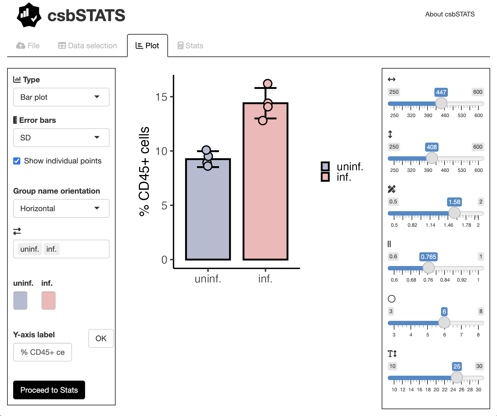
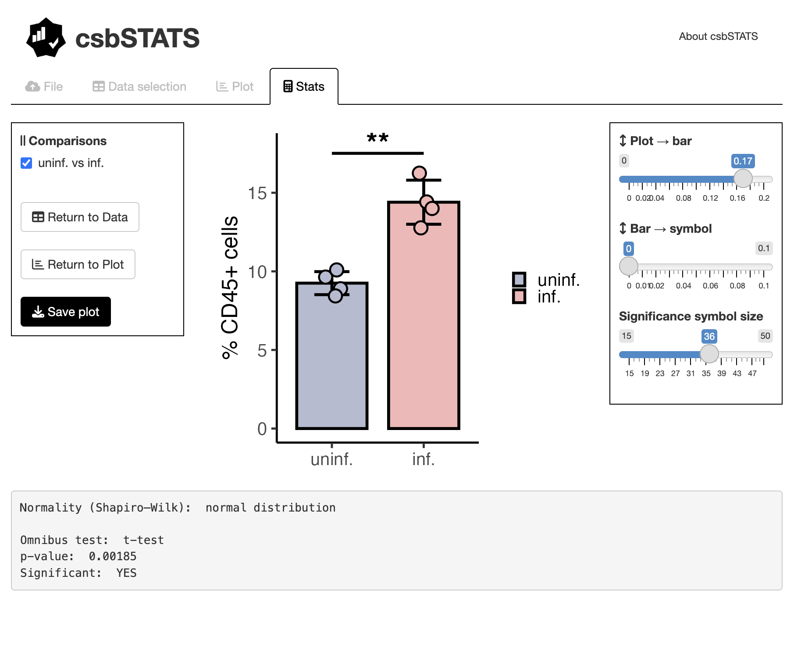

<!-- README.md is generated from README.Rmd. Please edit that file -->

# csbSTATS

<!-- badges: start -->
<!-- badges: end -->

**csbSTATS** is is an open-source project that provides an user-friendly,
interactive user interface for exploratory data analysis, visualization,
and statistical testing.

## Installation

**csbSTATS** can be installed by first installing R and typing the following
commands in R console:

``` r
#to allow installation of GitHub packages
install.packages("devtools")

#csbSTATS can then be installed
devtools::install_github("BonilhaCaio/csbSTATS")
```

## Usage

**csbSTATS** Shiny-based user interface with all its tools is generated through
the package's single function:

``` r
csbSTATS::runCsbSTATS()
```

## User Guide

**csbSTATS** is launched as an interactive Shiny application for
exploratory data analysis, visualization, and statistical testing.

The workflow is organized into sequential tabs that guide the user from
data loading to statistical inference.

-   The application opens in the *Data selection* tab, where the user
    uploads a `.csv` file and defines experimental groups by selecting
    cells directly from the data table. Each group is assigned a custom
    name and stored internally for downstream analysis.



-   Once groups are defined, the *Plot* tab allows visualization of the
    data as bar plots or box plots. Users can customize error bars (SD or
    SEM), adjust plot dimensions, rotate axis labels, display individual
    data points, reorder groups, and assign custom colors to each group
    using an interactive colour picker.

<center>

</center>

-   Statistical analysis is performed in the *Stats* tab. Depending on
    data normality and the number of groups, the software automatically
    applies the appropriate statistical tests (t-test, Wilcoxon test,
    one-way ANOVA, Kruskal–Wallis), followed by multiple-comparison
    testing when applicable. Significance levels are displayed both
    graphically and as a detailed textual summary.

<center>

</center>

## Credits and citation

A publication where the package dependencies and imports will be appropriately
credited is on the way. Meanwhile, you can cite **csbSTATS** as follows:

``` r
citation("csbSTATS")
```
